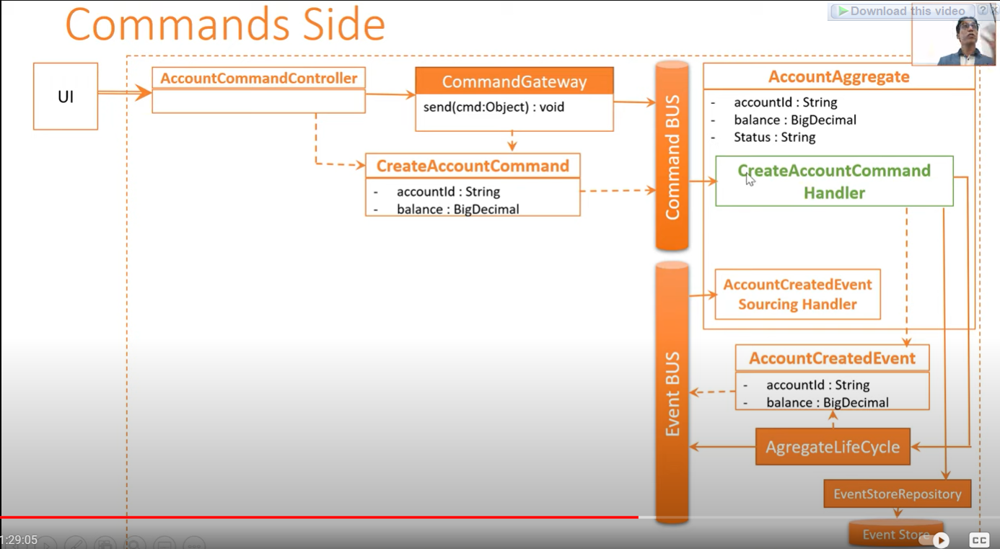
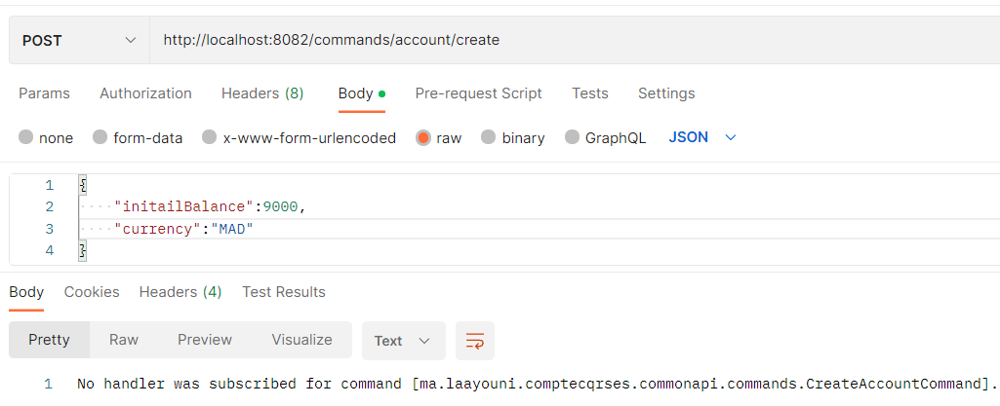
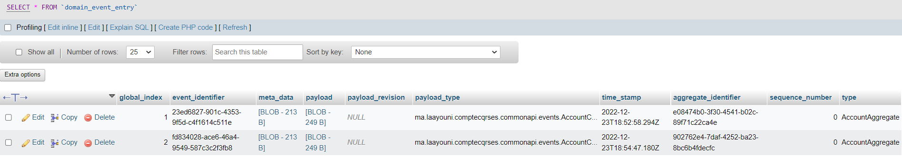

- [1-Spring Cloud streams kafka](#1-spring-cloud-streams-kafka)
    - [JMS (base de la communiction asynchrone):](#jms-base-de-la-communiction-asynchrone)
    - [ActiveMQ](#activemq)
    - [start kafka (in windows)](#start-kafka-in-windows)
    - [Test phase](#test-phase)
    - [Creating an application:](#creating-an-application)
- [2-CQRS and Event Sourcing AXON and Spring Cloud](#2-cqrs-and-event-sourcing-axon-and-spring-cloud)
- [3-Event Driven Micro Services Architecture with CQRS and Event Sourcing - Use case With Axon](#3-event-driven-micro-services-architecture-with-cqrs-and-event-sourcing---use-case-with-axon)

# 1-Spring Cloud streams kafka 
use asynchron
wuth the Help of brokers to garantee that the message is delivered to the client/user:
- rabbitMQ
- ActiveMQ
- Kafka
### JMS (base de la communiction asynchrone):

in the jms model once the message had been consumed it will be deleted (unlike kafka) and it can't see the message content

[](pictures/2.png)

avec le modele Queue -> protocole point a point ->one to one
avec le modele Topic -> des qu'un message arrive il est diffuse au tous les consommateur
- exemple de producer JMS 
- exemple de consumer JMS 
### ActiveMQ
on va implepenter cette application 
3 methode de travailler :
- KafkaTemplate `@KafkaListener`: dedie au kafka application
- Spring cloud stream : generic independante du brokers -> peut l'utilise avec kafak, RabitMq ....
  - MessageChannel (deprecated)
  - **Spring cloud streams function** on va utilise ceci
### start kafka (in windows)
1. start zookeeper 
```cmd
start .\bin\windows\zookeeper-server-start.bat .\config\zookeeper.properties
```
zookeeper start in port `2181`
Error : The input line is too long

Fix : just try to put the folder in a smaller path or rename it to just kafka

2. start kafka server
```cmd
start bin\windows\kafka-server-start.bat config\server.properties
```
kafka start in port `9092`
### Test phase
*We will test with kafka console consumer and kafka console producer*
1. kafka consumer :
   - to start use the command : `start bin\windows\kafka-console-consumer.bat --bootstrap-server localhost:9092 --topic R1`
   - `--bootstrap-server localhost:9092` to specify where kafka is
   - `--topic R1` to create a topic and give it a name
   - now the consumer will wait until it receives a messages through the topic
2. kafka producer :
   1. start using the command : `start bin\windows\kafka-console-producer.bat --broker-list localhost:9092 --topic R1`
3. test :
  
### Creating an application:
1. dependencies used (another ones will be added later) : 
2. 
   1. spring cloud messeaging cloud stream


Error : showing a classpath error relating to a database even though I didn't add any database dependency 
Fix : added h2 database in the dependencies
Reason : don't know why ^^

start a consumer listening to R1 topic `start bin\windows\kafka-console-consumer.bat --bootstrap-server localhost:9092 --topic R1`

go to url `http://localhost:8080/publish/R1/mouad`

result : 
!! not finished !!

# 2-CQRS and Event Sourcing AXON and Spring Cloud
In the synchronous communication model
Problem : 
- when there is a service that calls another service that calls another .... if one is down everything will stop working 
  - if we want to make it scalable we will need to synchronous both or more service instances and their databases
    - here we can use an Event Bus (kafka, rabbitMQ,activeMQ)
    - One of the simplest solutions to fix th synchronisation problem and the access to multiple databases is to use on shared and centerlised database 
- there is also a considerable amount of time in the communication between the services (latency).

# 3-Event Driven Micro Services Architecture with CQRS and Event Sourcing - Use case With Axon

Structure : 
- we create an abstract clas with the base command :
```java
public abstract class BaseCommand<T> {
    @TargetAggregateIdentifier
    @Getter private T id;

    public BaseCommand(T id) {
        this.id = id;
    }
}
```
we only create the getters and the constructor
- In the inherited commands :
```java
public class CreateAccountCommand extends BaseCommand<String>{
    @Getter private double initialBalance;
    @Getter private String currency;

    public CreateAccountCommand(String id, double initialBalance, String currency) {
        super(id);
        this.initialBalance = initialBalance;
        this.currency = currency;
    }
}
```
we do the same for the other ones

- For the command Controllers
```java
@RestController
@RequestMapping(path = "/commands/account")
@AllArgsConstructor
public class AccountCommandController {
    private CommandGateway commandGateway;
    @PostMapping("/create")
    public CompletableFuture<String> createAccount(@RequestBody CreateAccountDTO request){
        CompletableFuture<String> commandResponse=commandGateway.send(new
                CreateAccountCommand(
                UUID.randomUUID().toString(),
                request.getInitialBanlance(),
                request.getCurrency()
        ));
        return commandResponse;
    }
}
```

- in the properties we will use MySQL as DB 
```properties
spring.application.name=compte-serice
spring.datasource.url=jdbc:mysql://${MYSQL_HOST:localhost}:${MYSQL_HOST:3306}/bank?createDatabaseIfNotExist=true
spring.datasource.username=${MYSQL_USER:root}
spring.datasource.password=${MYSQL_PASSWORD:}
spring.jpa.hibernate.ddl-auto=update
spring.jpa.properties.hibernate.dialect=org.hibrenate.dialect.MariaDBDialect
server.port=8082
```
`${MYSQL_HOST:localhost}` means either use `MYSQL_HOST` if th variable is defined if not use `localhost` as default

- We can also add Dtos:
```java
@Data
@NoArgsConstructor
@AllArgsConstructor
public class CreateAccountDTO {
    private double initialBanlance;
    private String currency;
}
```

!**Error** : if the commandGateway fire an exception about it not doesn't get injected -> try downgrading the spring boot version to `2.7.6`

- trying the Post Query gives the error :

we can return the error by adding in the controller an exception handler like this :
```java
@ExceptionHandler(Exception.class)
    public ResponseEntity<String> exceptionHandler(Exception exception){
        ResponseEntity<String> entity=new ResponseEntity<>(
                exception.getMessage(),
                HttpStatus.INTERNAL_SERVER_ERROR
        );
        return entity;
}
```

- we will need to create now a handler in the account aggregate (create it first)
```java
@Aggregate
public class AccountAggregate {
    @AggregateIdentifier
    private String accountId;
    private double balance;
    private String currency;
    private AccountStatus status;

    public AccountAggregate() {
    //Required by Axon
    }
   @CommandHandler
    public AccountAggregate(CreateAccountCommand createAccountCommand) {
    if (createAccountCommand.getInitialBalance()<0) throw new RuntimeException("balance negative");
        AggregateLifecycle.apply(new AccountCreatedEvent(
                createAccountCommand.getId(),
                createAccountCommand.getInitialBalance(),
                createAccountCommand.getCurrency()
        ));
    }
    @EventSourcingHandler
    public void on(AccountCreatedEvent event){
        this.accountId=event.getId();
        this.currency=event.getCurrency();
        this.balance=event.getInitialeBalance();
        this.status=AccountStatus.CREATED;
    }
}
```
the aggregate use an event that we need to also create :
```java
public class AccountCreatedEvent extends BaseEvent<String>{
    @Getter private double initialeBalance;
    @Getter private String currency;

    public AccountCreatedEvent(String id, double initialeBalance, String currency) {
        super(id);
        this.initialeBalance = initialeBalance;
        this.currency = currency;
    }
}
```
the abstract baseEvent has the same idea as the BaseCommand:
```java
public abstract class BaseEvent<T> {
    @Getter private T id;
    public BaseEvent(T id) {
        this.id = id;
    }
}
```
- Now when trying the Post Query it runs without errors
- we can see the results in the database  
- the data sent to the table `domain_event_entry` (event store) and in the payload we can find what we created (you can change it to json)
- To consult these events directly from a Get Route add to AccountCommandController :
```java
   private EventStore eventStore;
   @GetMapping("/eventStore/{accountId}")
    public Stream eventStore(@PathVariable String accountId){
        return eventStore.readEvents(accountId).asStream();
}
```
trying the Get Route : `http://localhost:8082/commands/account/eventStore/902762e4-7daf-4252-ba23-8bc6b4fdecfc`
results :
```json
[
    {
        "type": "AccountAggregate",
        "aggregateIdentifier": "902762e4-7daf-4252-ba23-8bc6b4fdecfc",
        "sequenceNumber": 0,
        "timestamp": "2022-12-23T18:54:47.180Z",
        "identifier": "fd834028-ace6-46a4-9549-587c3c2f3fb8",
        "payload": {
            "id": "902762e4-7daf-4252-ba23-8bc6b4fdecfc",
            "initialeBalance": 0.0,
            "currency": "MAD"
        },
        "metaData": {
            "traceId": "ecfc4253-3b83-4a81-8efd-f4cbc316235a",
            "correlationId": "ecfc4253-3b83-4a81-8efd-f4cbc316235a"
        },
        "payloadType": "ma.laayouni.comptecqrses.commonapi.events.AccountCreatedEvent"
    }
]
```

- We can use Sl4j for logging
Example in AccountServiceHandler
```java
@Service
@AllArgsConstructor
@Slf4j
public class AccountServiceHandler {
    private AccountRepository accountRepository;
    private OperationRepository operationRepository;

    @EventHandler
    public void on(AccountCreatedEvent event){
        log.info("******************************");
        log.info("AccountCreatedEvent received");
        log.info("******************************");
        accountRepository.save(new Account(
                event.getId(),
                event.getInitialeBalance(),
                event.getStatus(),
                event.getCurrency(),
                null
        ));

    }
}
```
!**ERROR** : Unable to make field private static final long java.util.concurrent.ConcurrentSkipListSet.serialVersionUID accessible: module java.base does not "opens java.util.concurrent" to unnamed module @13e39c73

-> *Fix* : add `--add-opens java.base/java.util=ALL-UNNAMED --add-opens java.base/java.util.concurrent=ALL-UNNAMED` to VM options 

- [Source](https://github.com/x-stream/xstream/issues/262#issuecomment-1247342505):  
   The workaround is to add all the --add-opens directives.
   The classes in java.util.concurrent have been a problem for us, especially AtomicBoolean (tracked in #308). We are hesitant to add an --add-opens directive for java.util.concurrent because we would generally prefer to avoid serializing concurrent types,   