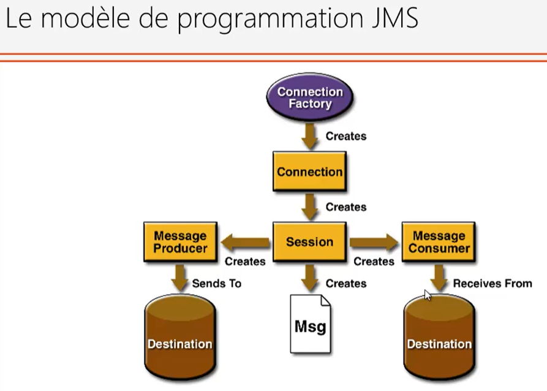
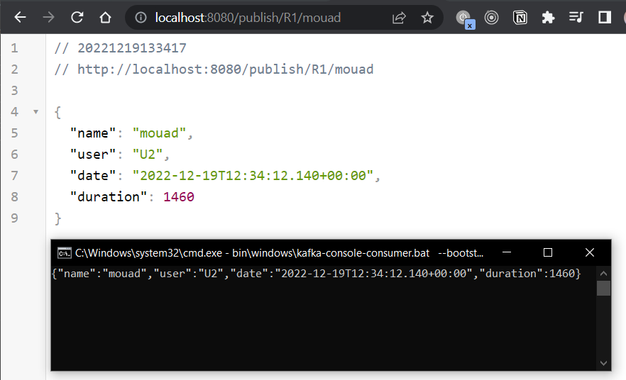

- [1-Spring Cloud streams kafka](#1-spring-cloud-streams-kafka)
    - [JMS (base de la communiction asynchrone):](#jms-base-de-la-communiction-asynchrone)
    - [ActiveMQ](#activemq)
    - [start kafka (in windows)](#start-kafka-in-windows)
    - [Test phase](#test-phase)
    - [Creating an application:](#creating-an-application)
- [CQRS and Event Sourcing AXON and Spring Cloud](#cqrs-and-event-sourcing-axon-and-spring-cloud)

# 1-Spring Cloud streams kafka 
use asynchron
wuth the Help of brokers to garantee that the message is delivered to the client/user:
- rabbitMQ
- ActiveMQ
- Kafka
### JMS (base de la communiction asynchrone):

in the jms model once the message had been consumed it will be deleted (unlike kafka) and it can't see the message content

[](pictures/2.png)

avec le modele Queue -> protocole point a point ->one to one
avec le modele Topic -> des qu'un message arrive il est diffuse au tous les consommateur
- exemple de producer JMS 
- exemple de consumer JMS 
### ActiveMQ
on va implepenter cette application 
3 methode de travailler :
- KafkaTemplate `@KafkaListener`: dedie au kafka application
- Spring cloud stream : generic independante du brokers -> peut l'utilise avec kafak, RabitMq ....
  - MessageChannel (deprecated)
  - **Spring cloud streams function** on va utilise ceci
### start kafka (in windows)
1. start zookeeper 
```cmd
start .\bin\windows\zookeeper-server-start.bat .\config\zookeeper.properties
```
zookeeper start in port `2181`
Error : The input line is too long

Fix : just try to put the folder in a smaller path or rename it to just kafka

2. start kafka server
```cmd
start bin\windows\kafka-server-start.bat config\server.properties
```
kafka start in port `9092`
### Test phase
*We will test with kafka console consumer and kafka console producer*
1. kafka consumer :
   - to start use the command : `start bin\windows\kafka-console-consumer.bat --bootstrap-server localhost:9092 --topic R1`
   - `--bootstrap-server localhost:9092` to specify where kafka is
   - `--topic R1` to create a topic and give it a name
   - now the consumer will wait until it receives a messages through the topic
2. kafka producer :
   1. start using the command : `start bin\windows\kafka-console-producer.bat --broker-list localhost:9092 --topic R1`
3. test :
  
### Creating an application:
1. dependencies used (another ones will be added later) : 
2. 
   1. spring cloud messeaging cloud stream


Error : showing a classpath error relating to a database even though I didn't add any database dependency 
Fix : added h2 database in the dependencies
Reason : don't know why ^^

start a consumer listening to R1 topic `start bin\windows\kafka-console-consumer.bat --bootstrap-server localhost:9092 --topic R1`

go to url `http://localhost:8080/publish/R1/mouad`

result : 
!! not finished !!

# CQRS and Event Sourcing AXON and Spring Cloud
In the synchronous communication model
Problem : 
- when there is a service that calls another service that calls another .... if one is down everything will stop working 
  - if we want to make it scalable we will need to synchronous both or more service instances and their databases
    - here we can use an Event Bus (kafka, rabbitMQ,activeMQ)
    - One of the simplest solutions to fix th synchronisation problem and the access to multiple databases is to use on shared and centerlised database 
- there is also a considerable amount of time in the communication between the services (latency).